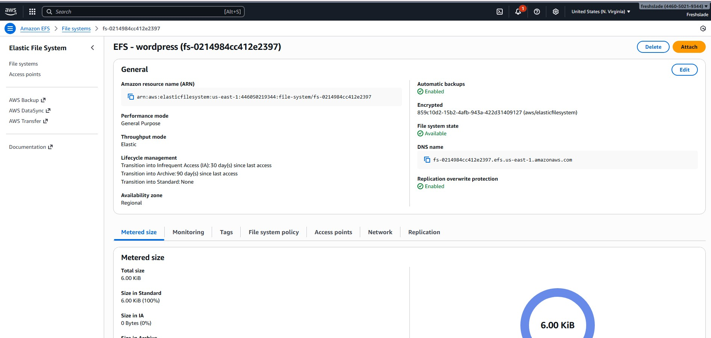

# 3-Tier-WordPress-Deployment-on-AWS-
A WordPress website deployed on AWS using (VPC • ALB • EC2 • RDS • EFS)
# 3‑Tier WordPress Deployment on AWS (VPC • ALB • EC2 • RDS • EFS)

## 📌 Overview

This project implements a **production-style 3‑Tier WordPress architecture** on AWS using fully isolated networking, managed database services, shared storage, and load balancing. The goal is to replicate a realistic, scalable cloud environment using core AWS services.

The stack includes:

* **Networking Tier:** VPC, public/private subnets, route tables, IGW, NAT Gateways
* **Compute Tier:** EC2 instances in private subnets for WordPress
* **Storage Tier:** EFS for shared WordPress files across AZs
* **Database Tier:** Amazon Aurora MySQL (RDS)
* **Access Layer:** Application Load Balancer (ALB) routing traffic to private EC2 instances

This mirrors real enterprise architectures used for high‑availability WordPress hosting.

---

## 🏗️ Architecture Diagram

---

## ⚙️ AWS Services Used

### **Networking**

* VPC (10.0.0.0/16)
* 2 Public Subnets
* 4 Private Subnets (App + Database tiers)
* Internet Gateway (IGW)
* 2 NAT Gateways
* Route Tables (Public + Private)

### **Compute & Storage**

* EC2 (Web tier)
* EFS (shared WordPress storage)

### **Database**

* Amazon Aurora MySQL (Writer + Reader endpoint)

### **Load Balancing & Access**

* Application Load Balancer (ALB)
* Target Groups
* Security Groups

---

## 📸 Screenshots

Below are the captured AWS console views used to document the deployment.

### **VPC Overview (Subnets, Route Tables, Connectivity)**

### **Internet Gateway**

### **NAT Gateways**

### **EC2 Instance (Private Subnet Webserver)**

### **Security Groups (EC2, ALB, EFS, RDS)**

### **Amazon EFS (Shared Storage Layer)**

### **RDS / Aurora MySQL Cluster (Writer & Reader Endpoints)**

### **WordPress Successful Deployment**

---

## 🚀 Deployment Workflow

### **1. Create VPC & Subnets**

* Created VPC with IPv4 CIDR: 10.0.0.0/16
* 2 Public Subnets (for ALB, NAT Gateways)
* 4 Private Subnets (App Tier + DB Tier)
* Enabled DNS support and hostnames

### **2. Configure Internet & NAT Gateways**

* Attached IGW for public outbound access
* Created **two** NAT Gateways in public subnets
* Updated private route tables to point 0.0.0.0/0 → NAT

### **3. Launch EFS**

* Created regional EFS filesystem
* Configured mount targets in private subnets
* Attached SG allowing NFS (2049) from EC2

### **4. Deploy EC2 WordPress Web Servers**

* EC2 launched in **private subnet**
* Installed Apache, PHP, WordPress
* Mounted EFS to `/var/www/html`
* Connected to RDS using the writer endpoint

### **5. Create Aurora MySQL DB Cluster**

* Created database cluster & writer instance
* Configured SG to allow port 3306 **from EC2 SG only**
* Created database `wordpressdb`

### **6. Configure Load Balancer**

* Application Load Balancer created in public subnets
* Target Group → EC2 instances
* Listener on HTTP port 80

### **7. Final WordPress Setup**

* Accessed ALB DNS to load WordPress installer
* Connected successfully to RDS
* Confirmed shared storage via EFS

---

## 📁 Project Outcomes

✔ Working 3‑Tier architecture across two AZs
✔ Fully private EC2 + RDS (no public exposure)
✔ WordPress persistent storage via EFS
✔ Secure traffic routing through ALB
✔ NAT‑secured outbound traffic for private subnets
✔ Clean and production‑styled cloud pattern

---

## 📌 Lessons Learned

* RDS clusters may expose multiple endpoints — always choose the **writer** endpoint for WordPress.
* DNS resolution **must** be enabled in the VPC or RDS hostnames fail.
* WordPress will not install until the DB name exists (requires manual creation in MySQL).
* Private subnets + NAT require precise route configuration.
* EFS mount points rely on correct SGs allowing NFS from EC2.

---

## 📎 Next Steps

* Expand to multi‑AZ EC2 Auto Scaling
* Add HTTPS using ACM + ALB
* Add S3 + CloudFront for static content offloading

---
